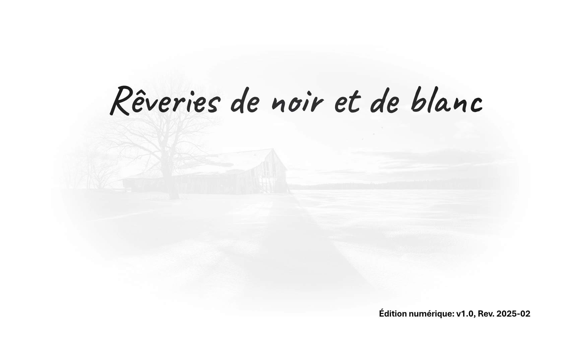
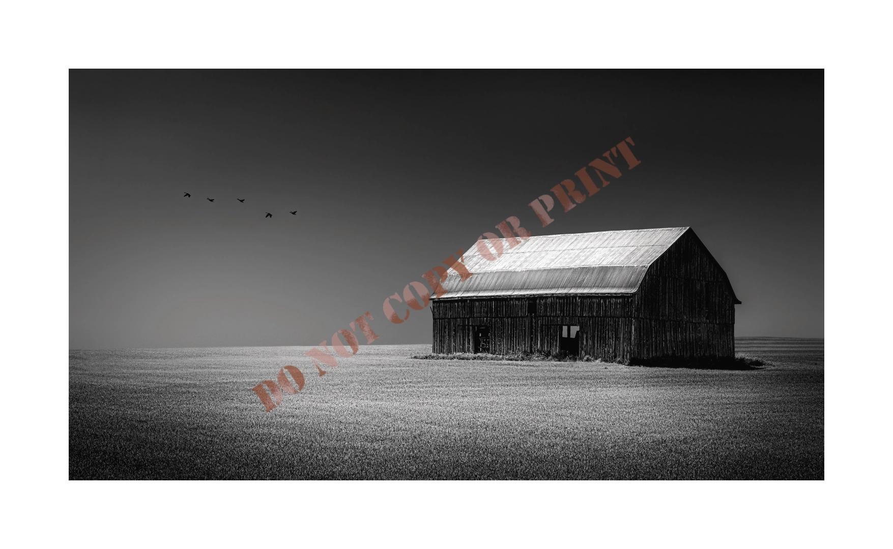
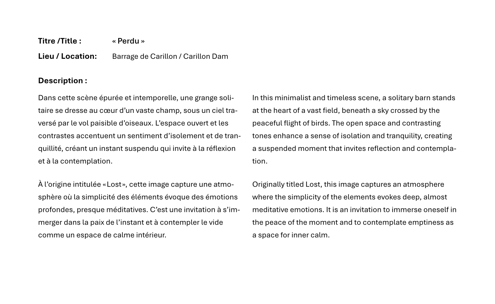

# Rêveries de noir et de blanc  
_A limited edition fine art photography book by Yves Gauvreau._

## 📖 About the Book  
A collection of black-and-white photographs exploring light, shadow, and emotion.  
Each edition is unique, handcrafted, and produced in a limited run.  

## 🔍 Preview  

  

*A glimpse into the book's design and presentation.*

  
*A moment captured in timeless monochrome.*

  

## 🏛️ Edition Details  
- Produced in a **minimum of three (3)** and a **maximum of eight (8)** copies.  
- Each book features **handcrafted covers and a custom case.**  
- The digital edition provides a reference but does not replicate the physical experience.

## 📄 View the Full Digital Edition  
🔗 **[Download the PDF](../pdf/ReveriesBilingue_v1.0_2025-02-1.pdf)**  
*For archival and reference use only.*  

---
✉️ _For more information, contact [your preferred contact method]._
